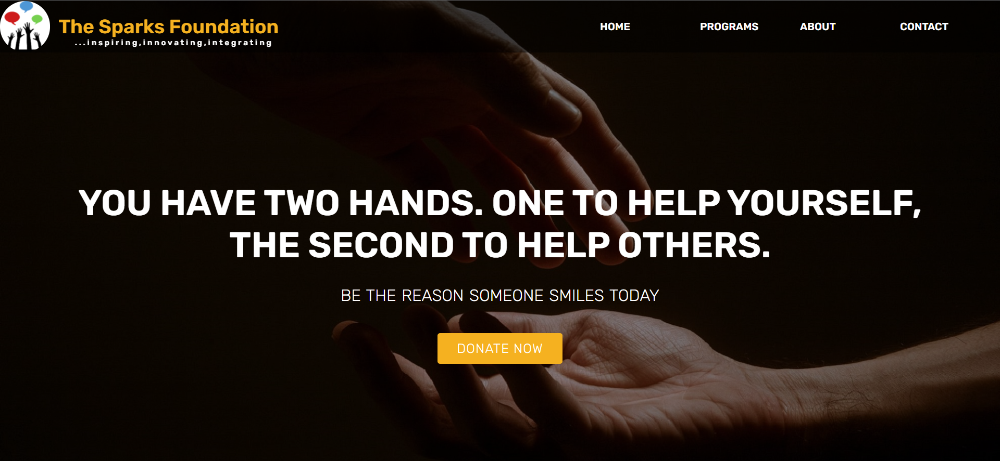
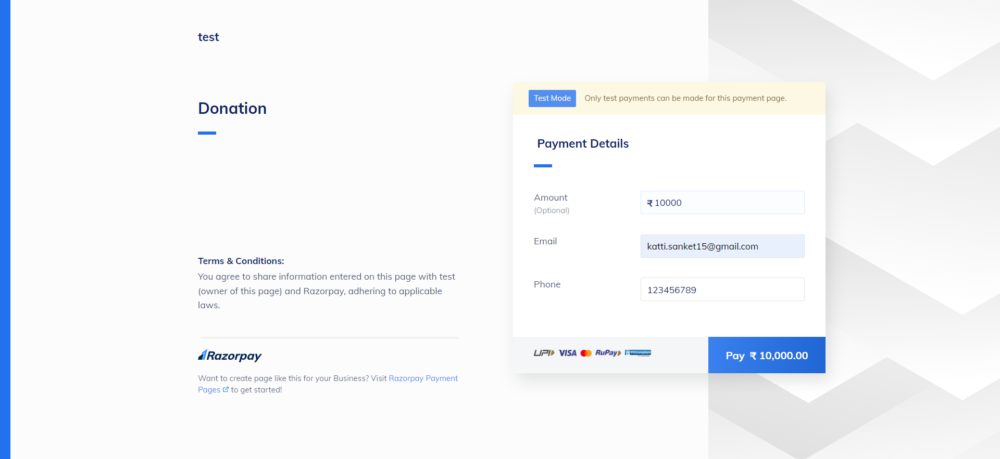
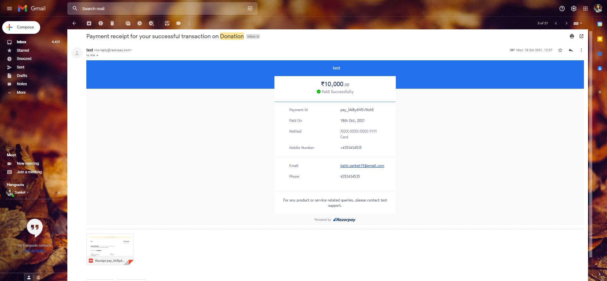

# Donation-Website  And 
Using HTML and CSS only. 

Payment Gateway Integration Project Created for Internship Under The Sparks Foundation.

There will be a simple donate button on the homepage. On clicking the donate button, the user will land on the payment page where the user can select the choice of a gateway than the amount to be paid and the payment type, e.g. credit card, Paypal, etc. 

Once the payment is done an invoice will be generated and an email will be sent to the user for the payment received. The invoice will contain the amount.

Thank You!
 

  

 
<h1>Home Page</h1>
 

  

 
<h1>Payment Page</h1>
 

  

 
<h1>Mail Recived with Receipt</h1>
 

  

